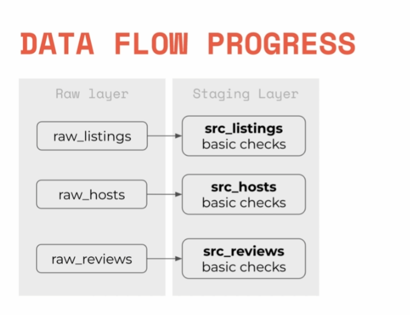

## Project where I'll use snowflake, DBT and preset to analyze data produced by airbnb

### First: Register to Snowflake
Go to [https://snowflake.net/](https://snowflake.net/) and register.
### Save region code and account name for later use
## Second: Create a worksheet
## Third: User creation
```
-- Use an admin role
USE ROLE ACCOUNTADMIN;
-- Create the `transform` role
CREATE ROLE IF NOT EXISTS transform;
GRANT ROLE TRANSFORM TO ROLE ACCOUNTADMIN;
-- Create the `dbt` user and assign to role
CREATE USER IF NOT EXISTS dbt
 PASSWORD='dbtPassword123'
 LOGIN_NAME='dbt'
 MUST_CHANGE_PASSWORD=FALSE
 DEFAULT_WAREHOUSE='COMPUTE_WH'
 DEFAULT_ROLE='transform'
 DEFAULT_NAMESPACE='AIRBNB.RAW'
 COMMENT='DBT user used for data transformation';
GRANT ROLE transform to USER dbt;
-- Create our database and schemas
CREATE DATABASE IF NOT EXISTS AIRBNB;
CREATE SCHEMA IF NOT EXISTS AIRBNB.RAW;
-- Set up permissions to role `transform`
GRANT ALL ON WAREHOUSE COMPUTE_WH TO ROLE transform; 
GRANT ALL ON DATABASE AIRBNB to ROLE transform;
GRANT ALL ON ALL SCHEMAS IN DATABASE AIRBNB to ROLE transform;
GRANT ALL ON FUTURE SCHEMAS IN DATABASE AIRBNB to ROLE transform;
GRANT ALL ON ALL TABLES IN SCHEMA AIRBNB.RAW to ROLE transform;
GRANT ALL ON FUTURE TABLES IN SCHEMA AIRBNB.RAW to ROLE transform
```
## Create tables for storing data
```
-- Set up the defaults
USE WAREHOUSE COMPUTE_WH;
USE DATABASE airbnb;
USE SCHEMA RAW;
-- Create our three tables and import the data from S3
CREATE OR REPLACE TABLE raw_listings
 (id integer,
 listing_url string,
 name string,
 room_type string,
 minimum_nights integer,
 host_id integer,
 price string,
 created_at datetime,
 updated_at datetime);
COPY INTO raw_listings (id,
 listing_url,
 name,
 room_type,
 minimum_nights,
 host_id,
 price,
 created_at,
 updated_at)
 from 's3://dbtlearn/listings.csv'
 FILE_FORMAT = (type = 'CSV' skip_header = 1
 FIELD_OPTIONALLY_ENCLOSED_BY = '"');
CREATE OR REPLACE TABLE raw_reviews
 (listing_id integer,
 date datetime,
 reviewer_name string,
 comments string,
 sentiment string);
COPY INTO raw_reviews (listing_id, date, reviewer_name, comments, sentiment)
 from 's3://dbtlearn/reviews.csv'
 FILE_FORMAT = (type = 'CSV' skip_header = 1
 FIELD_OPTIONALLY_ENCLOSED_BY = '"');
CREATE OR REPLACE TABLE raw_hosts
 (id integer,
 name string,
 is_superhost string,
 created_at datetime,
 updated_at datetime);
COPY INTO raw_hosts (id, name, is_superhost, created_at, updated_at)
 from 's3://dbtlearn/hosts.csv'
 FILE_FORMAT = (type = 'CSV' skip_header = 1
 FIELD_OPTIONALLY_ENCLOSED_BY = '"');
```
## Install DBT on Windows
I'll use WSL to install DBT, alias created "winhome".
## Install pip
```
curl -o get-pip.py https://bootstrap.pypa.io/get-pip.py
python get-pip.py
```
## I'll use a virtual environment to install DBT
```
pip install virtualenv
```
## Create a virtual environment
```
virtualenv venv
```
## Activate the virtual environment
```
source venv/bin/activate
```
## See the list of packages installed
```
pip list --format=columns
```
## Install DBT
```
pip install dbt-snowflake
```
## Creating a DBT project and connecting to Snowflake
```
dbt init airbnb
```
## Configure the connection to Snowflake
```
dbt config --provider snowflake --connect "account=dbt;warehouse=COMPUTE_WH;database=AIRBNB;schema=AIRBNB.RAW"
```
## You can see your credentials doing
```
cat ~/.dbt/profiles.yml
```
## Make sure the connection is working
```
dbt debug
```
## Materializations: Overview

## Data Flow Process

## Creating raw_listings AS 
```
WITH raw_listings AS (
    SELECT * FROM AIRBNB.RAW.RAW_LISTINGS
)
SELECT 
     id AS listing_id,
     name AS listing_name,
     listing_url,
     room_type,
     minimum_nights,
     host_id,
     price AS price_str,
     created_at,
     updated_at
FROM
 raw_listings
``` 
## Create src_listings in models folder and then execute dbt
```
dbt run
```
## Create src_reviews.sql
```
WITH raw_reviews AS (
    SELECT * FROM AIRBNB.RAW.RAW_REVIEWS
)
SELECT 
    listing_id,
    date AS review_date,
    reviewer_name,
    comments as review_text,
    sentiment as review_sentiment
FROM 
    raw_reviews
```
## Create src_reviews.sql in models folder and then execute dbt
```
dbt run
```
## Create src_hosts.sql
```
WITH raw_hosts AS (
    SELECT * FROM AIRBNB.RAW.RAW_HOSTS
)
SELECT 
    ID AS HOST_ID,
    NAME AS HOST_NAME,
    IS_SUPERHOST,
    CREATED_AT,
    UPDATED_AT
FROM RAW_HOSTS
```
## Create src_hosts.sql in models folder and then execute dbt
```
dbt run
```
## Now we'll work on dim tables

## Create dim_listings_cleansed and dim_hosts_cleansed views
```
WITH src_listings AS (
    SELECT * FROM {{ref('src_listings')}}
)
SELECT 
    listing_id,
    listing_name,
    room_type,
    CASE
        WHEN minimum_nights = 0 THEN 1
        ELSE minimum_nights
    END AS minimum_nights,
    host_id,
    REPLACE(
        price_str,
        '$'
    ) :: NUMBER(
        10,
        2
    ) AS price,
    created_at,
    updated_at
FROM src_listings
```
```
WITH src_hosts AS (
    SELECT * FROM {{ref('src_hosts')}}
)
SELECT 
    HOST_ID,
    CASE 
        WHEN HOST_NAME IS NOT NULL THEN HOST_NAME
        ELSE NVL(HOST_NAME,'Anonymous')
    END AS HOST_NAME,
    IS_SUPERHOST,
    CREATED_AT,
    UPDATED_AT
FROM src_hosts
```
## Change how dim tables will be materialized
## In the dbt_project.yml file, change the materialized_views section
```
models:
  dbtlearn:
    +materialized: view
    dim:
      +materialized: table
```
## Create an incremental materialization. We'll call it  fct_reviews.sql
## You can specify the incremental materialization on the top of the file
## Querys for the incremental materialization
### Get every review for listing 3176:
```
SELECT * FROM "AIRBNB"."DEV"."FCT_REVIEWS" WHERE listing_id=3176;
```
### Add a new record to the table:
```
INSERT INTO "AIRBNB"."RAW"."RAW_REVIEWS"
VALUES (3176, CURRENT_TIMESTAMP(), 'Zoltan', 'excellent stay!', 'positive');
```
### Rebuild incremental tables
```
dbt run --full-refresh
```
## Create dim_listings_w_hosts.sql file
```
WITH
l AS (
 SELECT
 *
 FROM
 {{ ref('dim_listings_cleansed') }}
),
h AS (
 SELECT * 
 FROM {{ ref('dim_hosts_cleansed') }}
)
SELECT 
 l.listing_id,
 l.listing_name,
 l.room_type,
 l.minimum_nights,
 l.price,
 l.host_id,
 h.host_name,
 h.is_superhost as host_is_superhost,
 l.created_at,
 GREATEST(l.updated_at, h.updated_at) as updated_at
FROM l
LEFT JOIN h ON (h.host_id = l.host_id)
```
## Add ephemeral materialization to the dbt_project.yml file
```
models:
  dbtlearn:
    +materialized: view
    dim:
      +materialized: table
    src:
      +materialized: ephemeral
```
## Drop views after ephemeral materialization
```
DROP VIEW AIRBNB.DEV.SRC_HOSTS;
DROP VIEW AIRBNB.DEV.SRC_LISTINGS;
DROP VIEW AIRBNB.DEV.SRC_REVIEWS;
```
## Change materialization to view for dim_hosts_cleansed and dim_listings_cleansed
```
{{
 config(
 materialized = 'view'
 )
}}
```
## Seeds ans sources

## You can add your seeds in seeds folder on the project root
## Then execute:
```
dbt seed
```
## Sources can be specified in a .yml file in the models folder
## Sources are very useful when you want to use a data source that can be moved to another location
## Check if the project has an error
```
dbt compile
```
## Add freshness to the project
## In the sources.yml file, add the following line:
```
loaded_at_field: date
 freshness:
 warn_after: {count: 1, period: hour}
 error_after: {count: 24, period: hour}
```
## Check the freshness of the data
```
dbt source freshness
```
## Add snapshots to the project:
## What is snapshot in Snowflake?
Snowflake's zero-copy cloning feature provides a convenient way to quickly take a “snapshot” of any table, schema, or database and create a derived copy of that object which initially shares the underlying storage.
## Test your snapshot with:
```
dbt snapshot
```
## You can see changes updating data in snowflake:
```
UPDATE AIRBNB.RAW.RAW_LISTINGS SET MINIMUM_NIGHTS=30,
 updated_at=CURRENT_TIMESTAMP() WHERE ID=3176;
```
## Execute again dbt snapthot and then execute:
```
SELECT * FROM AIRBNB.DEV.SCD_RAW_LISTINGS WHERE ID=3176;
```
## Tests

## Generic tests: Create source.yml (you can create whatever you want) where you can specify the tests that you want to run:
```
version: 2
models:
  - name: dim_listings_cleansed
    columns:
    - name: listing_id
      tests:
       - unique
       - not_null
```
## Run the tests
```
dbt test
```
## Then you can see if your tests are passing
## Debug a test
## When a test fails, you can debug it by running:
```
code/cat target/compiled/dbtlearn/models/{path_to_test.yml}/{test_name}
```
## Accepted values debug:
```
with all_values as (

    select
        room_type as value_field,
        count(*) as n_records

    from airbnb.dev.dim_listings_cleansed
    group by room_type

)

select *
from all_values
where value_field not in (
    'Entire home/apt - break this','Private room','Shared room','Hotel room'
)
```
## Singular test: They live in the tests folder
## Run only tests related to a specific model
```
dbt test --select dim_listings_cleansed
```
## Macros:

## Create no_nulls_in_columsn macro (Use Jinja documentation to create your own macros)):
```
% macro no_nulls_in_columns(model) %}
 SELECT * FROM {{ model }} WHERE
 
 {{ col.column }} IS NULL OR
 
 FALSE

```
## Create a test-model to test the macro:
```{{
no_nulls_in_columns('dim_listings_cleansed')}}
```
## Custom generic tests
## Create positive_values test in macros folder:
```

SELECT
 *
FROM
 {{ model }}
WHERE
 {{ column_name}} < 1

```
## Add a test in schema.yml file:
```
- name: minimum_nights
      tests: 
        - positive_values
```
## Run the tests
```
dbt test
```
## Third-party Packages
Visit [Hub GetDBT](hub.getdbt.com)
## Install dbt-utils
Include the following in your packages.yml file:
```
packages:
  - package: dbt-labs/dbt_utils
    version: 0.8.6
```
Run  ```dbt deps``` to install the package.
## Use surrogate_key: 
## Add the following line in fct_reviews.sql:
```
 {{ dbt_utils.surrogate_key(['listing_id', 'review_date', 'reviewer_name', 'review_text']) }}
```
### Rebuild incremental tables on select fct_reviews
```
dbt run --full-refresh --select fct_reviews
```

